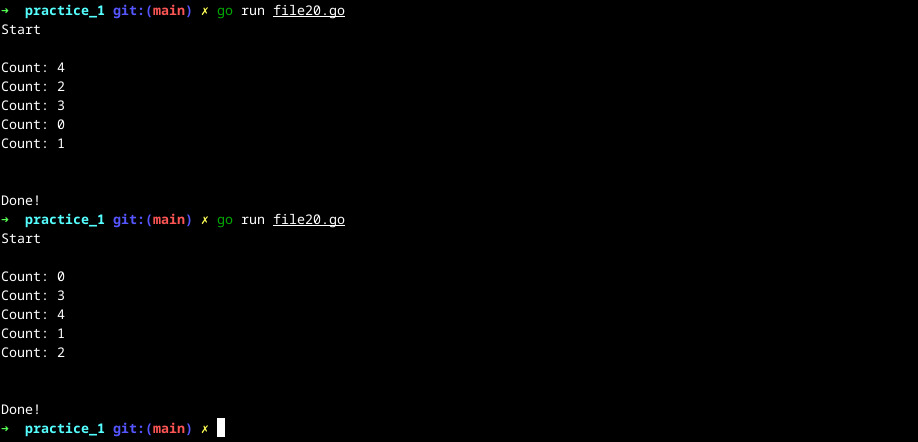

+++
title = 'Limit concurrency'
date = 2024-07-22
+++

## Table of contents

1. Introduction

# Problem statement

How to limit number of goroutines started 


```go
package main

import (
	"fmt"
	"sync"
)

func main() {
	var wg sync.WaitGroup

	totalGoRoutines := 5

	fmt.Println("Start\n")
	for i := 0; i < totalGoRoutines; i++ {
		wg.Add(1)
		go printCount(i, &wg)
	}

	wg.Wait()
	fmt.Println("\n\nDone!")
}

func printCount(count int, wg *sync.WaitGroup) {
	defer wg.Done()

	fmt.Printf("Count: %d\n", count)
}
```

Output:




# Reference

1. 